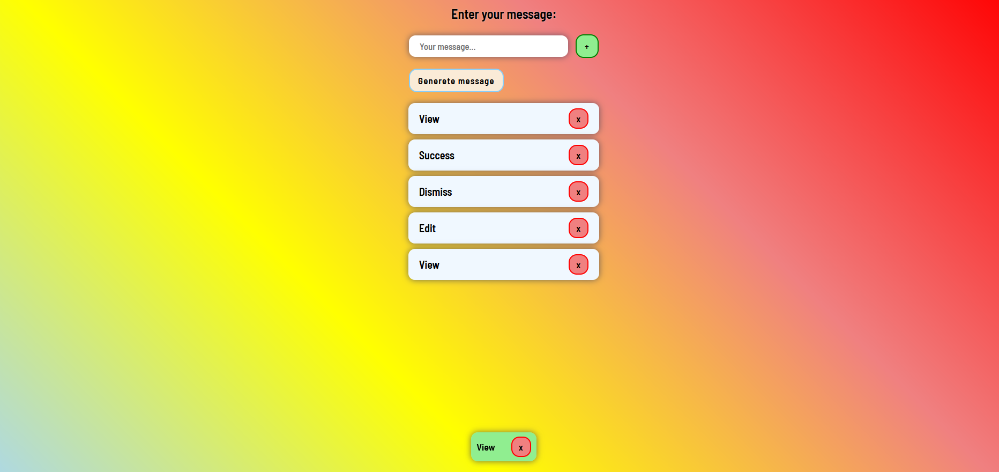

# TomTom recruitment task



## About

Simple web app that shows JavaScript/TypeScript usage. Created with TypeScript, HTML and CSS only. You can add messeges to list or generete random one. When message is added toast shows up. Toast shows only the most recent message. It will show up again if most recent message is deleted. Messages can be stored in local storage (by default they are).

## Setup

Clone this repository, run live server or other server. (If you are using VS code there is live-server extension).

```
Install live server or use VScode extension:
npm install -g live-server
...
cd ./tomtom-recruitment-task
live-server
```
